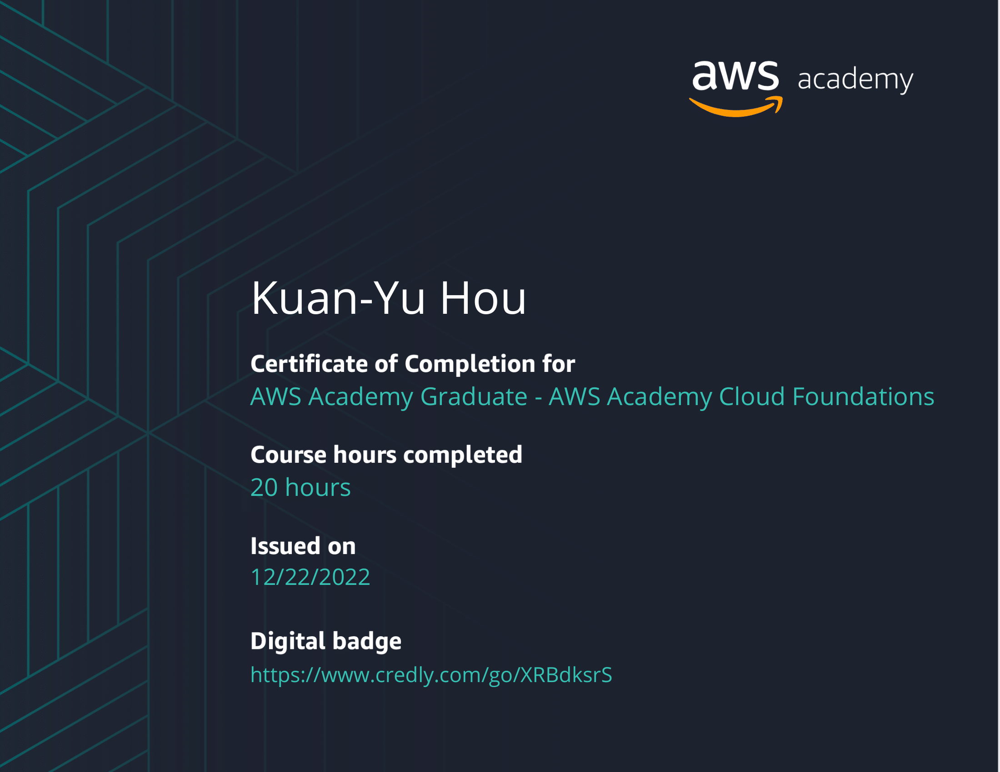

<h1 align="center">Hi 👋, I'm Doreen</h1>

My name is Kuan-Yu Hou, also known as Doreen. I am a student from Taiwan. Currently, I am pursuing my second master's degree in Data & Business Analysis at Rennes School of Business. Besides, I hold an MBA in information management at National Taipei University. I’m specializing in Data Business Analytics, I also have a strong interest in cloud computing.

- 🔭 I’m currently studying for [MSc in International Management in Data and Business Analytics](https://www.rennes-sb.com/programmes/postgraduate/discover-masters/master-of-science-in-international-management/)

- 👨‍💻 My Personal [Website](https://doreenhou.github.io/)

- 🌱 I’m currently learning **Python and Data Analytic**

- 👯 I’m currently collaborating on [Data Science Project](https://github.com/r41ss4/rennes_ds)

- 📰 All of my projects are available at [GitHub](https://github.com/DoreenHou)

- 📫 How to reach me **[kuan-yu.hou@rennes-sb.com](mailto:kuan-yu.hou@rennes-sb.com)**

- 📄 Know about my experiences on my [LinkedIn](https://www.linkedin.com/in/hou-kuanyu/)
  
- 🤝 Look at my **[resume](https://github.com/DoreenHou/DoreenHou/blob/main/images/CV_KuanYu-Hou.pdf)**

- ⚡ Motto **"Better late than never"**

<!--- My projects -->
<h3 align="left"> My projects </h3>

- ✈️ **[Aviation: Collaboration project of Data Analytics with Python at RSB](https://github.com/r41ss4/rennes_da)**
- 🎥 **[Netflix: Collaboration project of Business Analytic with Python at RSB](https://github.com/r41ss4/rennes_ba)**
- 📝 **[Visa: Collaboration project of SmartContract with Solidity at NTPU](https://github.com/DoreenHou/SmartContract_passport)**
- 💄 **[SkinCare: Collaboration project of Image Recognition with openCV at TKU](https://github.com/DoreenHou/SkinCare)**
- 💅 **[Sephora: Collaboration project of Data Science with Python at RSB](https://github.com/r41ss4/rennes_ds)**
- 📈 **[TSMC Stock: Collaboration project of Time Series Analysis with R at RSB](https://github.com/DoreenHou/rennes_ts)**

<!---  -->

<!--- Connect with me -->
<h3 align="left">Connect with me:</h3>

<!--- Languages and Tools -->
<h3 align="left">Languages and Tools:</h3>

   
   
   
  
   
   

  
  
   
    
  
   
  <a href="https://www.microsoft.com/es-es/microsoft-365/excel" target="_blank" rel="noreferrer">  
  

<!--- Badges & Certifications -->
<h2 align="left"> Badges  & Certifications </h2>
<h3 align="left"> Badges </h3>

   
  
  
  

<h3 align="left"> Certifications </h3>
  
  
  
  
  
  
  
  

<!--- GitHub Stats -->
<h2 align="left">My GitHub Stats </h2>

